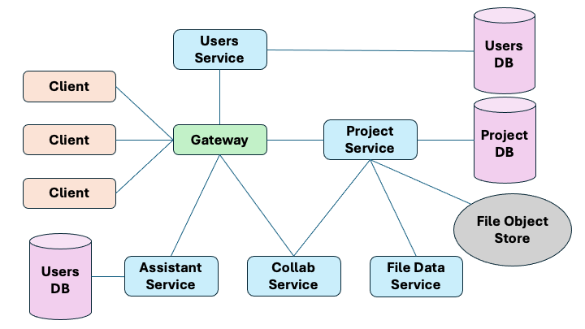

# SyncTeX


SyncTeX is a browser-based collaborative LaTeX editor for creating, organizing,
and editing LaTeX projects online.

The public service is available at [https://sync-tex.com](https://sync-tex.com).

## What It Does

- Edit LaTeX projects in the browser with a Monaco-based editor.
- Organize projects with files, directories, and project metadata.
- Collaborate in real time using Yjs document synchronization.
- Share projects through collaborator roles and invite links.
- Sign in with email/password, GitHub OAuth, or Google OAuth.
- Use an optional AI assistant with streamed chat responses.
- Store project content through MinIO-backed object storage.
- Maintain legal and privacy documentation for the public service.

## Status

SyncTeX is an active personal project and public web service. It is not currently
maintained as a contributor-driven open-source project, and the repository is
optimized for development, deployment, and operational clarity rather than a
large external contributor workflow.

The service is operated on a best-effort basis. Important documents should still
be backed up outside the application.

## Using The Web App

1. Visit [sync-tex.com](https://sync-tex.com).
2. Create an account or sign in with GitHub or Google.
3. Create a project from the dashboard.
4. Add LaTeX files and directories to the project.
5. Open a file in the editor and edit it in the browser.
6. Invite collaborators when a project should be shared.
7. Use the assistant panel when AI help or document context is needed.

The production service policies are kept in [docs/legal/privacy.md](docs/legal/privacy.md)
and [docs/legal/tos.md](docs/legal/tos.md).

## Architecture

SyncTeX is split into focused services behind nginx. Each service owns its own
runtime concerns and, where applicable, its own PostgreSQL database.



| Component | Stack | Responsibility |
| --- | --- | --- |
| `frontend/` | React, Vite, Monaco, Yjs | Browser UI, editor shell, project dashboard, collaboration panels |
| `nginx/` | nginx | Static frontend serving, API gateway, WebSocket routing |
| `users-service/` | Python, FastAPI, PostgreSQL | Accounts, OAuth, password auth, JWT issuance |
| `projects-service/` | Go, Gin, PostgreSQL, sqlc | Project/file metadata, collaborators, invites, presigned object URLs |
| `collab-service/` | Go, WebSocket, Yjs protocol relay | Real-time editing rooms and raw Yjs update broadcasting |
| `file-data-service/` | Rust, tonic, yrs | Yjs compaction and plain-text export over gRPC |
| `assistant-service/` | Python, FastAPI, PostgreSQL, pgvector | BYOK keys, chat history, SSE streaming, auto-context/RAG support |
| `minio` | MinIO | Object storage for document snapshots, update logs, and exports |

### Design Notes

- JWTs are issued by `users-service` and independently validated by backend
  services.
- Project metadata and object-storage access are owned by `projects-service`.
- Collaborative editing uses Yjs; the collaboration relay forwards binary Yjs
  frames rather than implementing a custom CRDT.
- `file-data-service` owns document compaction and text export so other services
  do not need to understand Yjs internals.
- The assistant service keeps LLM keys, chat history, usage data, and
  auto-context state separate from project metadata.
- Presigned MinIO URLs are generated internally and rewritten for browser-facing
  access at the public origin.

## Repository Layout

```text
.
|-- assistant-service/      # AI assistant, provider keys, chat, auto-context
|-- collab-service/         # WebSocket/Yjs collaboration relay
|-- docs/                   # Diagrams, legal docs, generated API references
|-- file-data-service/      # Yjs compaction and text export service
|-- frontend/               # React web application
|-- nginx/                  # API gateway and production frontend image
|-- projects-service/       # Project/file metadata and MinIO URL orchestration
|-- proto/                  # Shared gRPC definitions
|-- tests/                  # Service integration test harnesses
|-- users-service/          # Authentication and user identity service
|-- docker-compose.yml      # Base Compose stack
|-- docker-compose.dev.yml  # Development overrides
|-- docker-compose.prod.yml # Manual production overrides
`-- docker-compose.swarm.yml
```

## Local Development

Prerequisites:

- Docker Compose
- Node.js and npm for the Vite frontend dev server
- A populated `.env` file based on `.env.example`

Create the environment file:

```sh
cp .env.example .env
```

For local development, replace example secrets and set public origins in `.env`
to match the local environment you are testing. OAuth sign-in also requires
matching callback URLs in the GitHub and Google OAuth app configuration.

Start the backend stack:

```sh
make dev-build
make dev-up
```

Start the frontend dev server:

```sh
cd frontend
npm install
npm run dev
```

Open `http://localhost`.

Useful development commands:

```sh
make dev-logs
make dev-logs SERVICE=projects-service
make dev-ps
make dev-down
make dev-reset
```

Common local endpoints:

| Endpoint | Purpose |
| --- | --- |
| `http://localhost` | nginx gateway |
| `http://localhost:8001` | users service |
| `http://localhost:8003` | projects service |
| `http://localhost:8000` | assistant service |
| `localhost:50051` | file-data gRPC service |
| `http://localhost:9000` | MinIO API |
| `http://localhost:9001` | MinIO console |

## Deployment

The production path uses Docker images, Docker Swarm, a self-hosted GitHub
Actions runner, and a Cloudflare Tunnel sidecar. The deployment runbook is kept
in [docs/deployment-runbook.md](docs/deployment-runbook.md).

Manual production Compose commands are still available:

```sh
make prod-build
make prod-up
make prod-logs
make prod-down
```

For production, all example secrets, database passwords, OAuth credentials,
MinIO credentials, encryption keys, and public URL values must be replaced before
starting the stack.

## API And Service References

- [Projects service OpenAPI reference](docs/projects-service/openapi.yaml)
- [Generated projects service HTML reference](docs/projects-service-api.html)
- [Collaboration service AsyncAPI reference](docs/collab-service/asyncapi.yaml)
- [Users service database diagram](docs/users-service/users-db-erd.png)
- [Projects service database diagram](docs/projects-service/projects-db-erd.png)

## License

No open-source license is currently provided. Unless a license is added, all
rights are reserved by the project owner.
